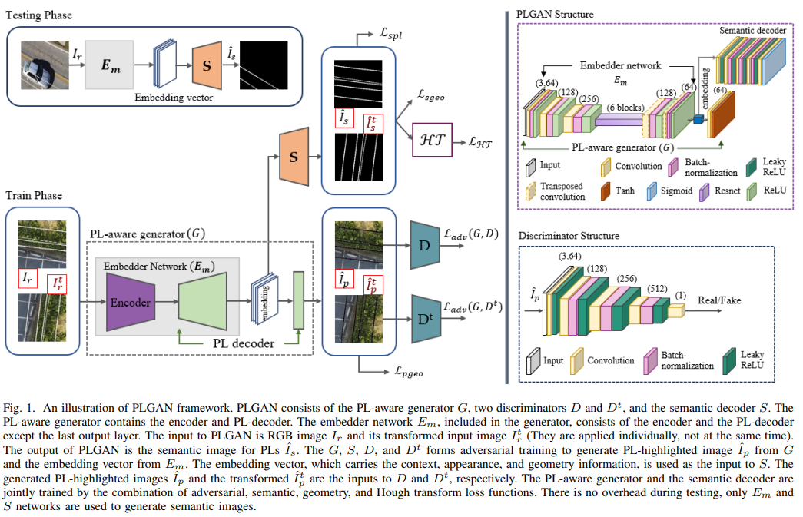
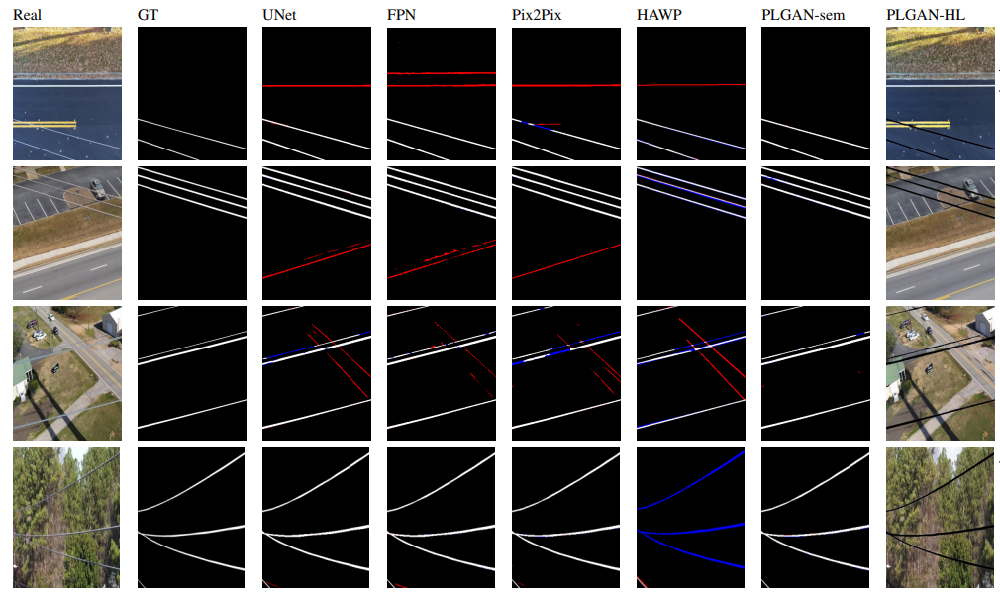
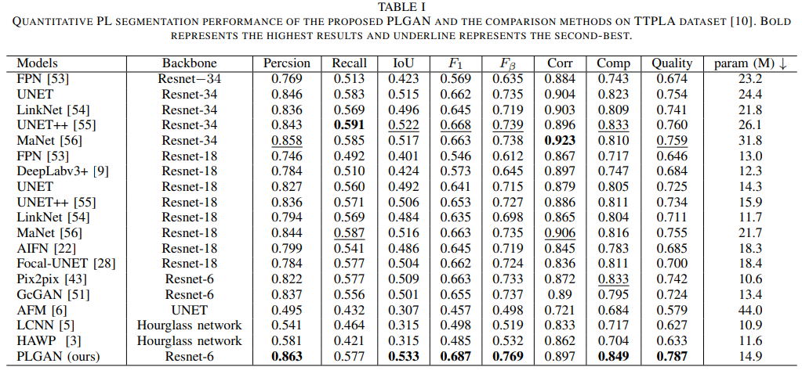

# PLGAN: Generative Adversarial Networks for Power-Line Segmentation in Aerial Images

PLGAN: Generative Adversarial Networks for Power-Line Segmentation in Aerial Images. 
This is the official repository of paper [PLGAN: Generative Adversarial Networks for Power-Line Segmentation in Aerial Images](https://arxiv.org/abs/2204.07243). (under submission)



## Main contributions are summarized as below:
* A novel PLGAN network is proposed to segment very thin PLs from aerial images with complex backgrounds. To the best of our knowledge, this is the first generative adversarial network (GAN) developed for line structure segmentation. The novelty comes from using the PL-highlighted images for discrimination and introducing the semantic decoder with the most representative embedding vectors as the input to generate semantic images.
* A new loss function is introduced in the modified Hough transform parameter space and then combined to adversarial, geometry, and cross entropy losses to enhance PL segmentation performance.
* The proposed PLGAN significantly promotes the state-of-the-art performance of PL segmentation on the public TTPLA dataset. To show the generality of the proposed method, we also apply PLGAN to the Massachusetts Roads dataset for segmenting roads, which are also long and thin as PLs.

#Datasets:
* TTPLA Power Line Dataset: 
   https://github.com/R3ab/ttpla_dataset
* MASSACHUSETTS Roads Dataset:   https://www.cs.toronto.edu/~vmnih/data/ 
## Results:

Average Precision for Different Deep Learning Models on TTPLA is reported in the following table




## Code Implementation:
   The code is coming soon.
   
## Citation:
```
@inproceedings{plgan-2022,
  author    = {Rabab Abdelfattah, Xiaofeng Wang, Song Wang},
  title     = {PLGAN: Generative Adversarial Networks for Power-Line Segmentation in Aerial Images},
  booktitle = {arxiv},
  year      = {2022},
}
```
## Contact:
For questions about our paper or code, please contact [Rabab Abdelfattah](rabab@email.sc.edu).
